<h1 align="center">Laurent Deusdedith</h1>

  <b>Data Engineer building the data foundations that intelligent systems depend on</b> 
  MSc Data Science &amp; AI (NMAIST) · Research focus: Applied Computer Vision · Direction: Multimodal AI

  <a href="mailto:laurentdeusdedith75@gmail.com">Email</a> ·
  <a href="https://github.com/Lau-Jr/nyc-taxi-data-engineering">Flagship project</a> ·
  <!-- TODO: add LinkedIn / Google Scholar links here, e.g. <a href="https://www.linkedin.com/in/your-handle">LinkedIn</a> · -->
  Tanzania

---

I design and build **data pipelines and analytical data platforms**: ingestion, validation, modeling and
reliable delivery of data that downstream analytics and models can trust. That is my professional foundation.

In my MSc, I apply the same discipline to **computer vision for real-world problems**. The work covers
dataset construction, evaluation under distribution shift and validation in the field, not only model training.

Over the longer term I am working toward **AI engineering and multimodal AI research**: complete systems
that connect data, perception and language. My starting assumption is simple:

> **Reliable AI starts with reliable data.** Most model failures in deployment trace back to how the data was
> collected, labeled, validated and served.

---

## The stack I work across

Each layer depends on the one beneath it. I am strongest at the bottom of this stack and am deliberately
building upward.

```mermaid
flowchart LR
    A["Data sources<br/>files · APIs · DBs · sensors · images"] --> B["Data engineering<br/>ingest · validate · model · orchestrate"]
    B --> C["Trusted data<br/>warehouse / lakehouse · curated datasets"]
    C --> D["ML & computer vision<br/>train · evaluate · stress-test · deploy"]
    D --> E["LLMs & multimodal models<br/>RAG · vision-language"]
    E --> F["Intelligent applications<br/>tool-using agents · field systems"]

    classDef core fill:#1f6feb,stroke:#1f6feb,color:#ffffff;
    classDef active fill:#2ea043,stroke:#2ea043,color:#ffffff;
    classDef growth fill:#ffffff,stroke:#8b949e,color:#57606a,stroke-dasharray: 4 3;
    class A,B,C core;
    class D active;
    class E,F growth;
```

🟦 **Professional core**: what I build today &nbsp;·&nbsp; 🟩 **Active research**: MSc focus &nbsp;·&nbsp; ⬜ **Growth direction**: currently studying, not yet claimed expertise

---

## What I build: Data Engineering

My work centers on getting data **from where it is produced into a form people and models can rely on**:

- **Ingestion**: batch loads from files, APIs and operational databases into analytical storage. Streaming is an area I am currently building out.
- **Validation and data quality**: explicit rules, tiered handling of bad records (reject vs. flag) and auditable rejects, so that no rows are silently dropped.
- **Modeling**: dimensional / star-schema design for analytical workloads, with documented schemas and data dictionaries.
- **Reliability**: idempotent, re-runnable loads; deterministic keys; tests around the ingestion path.
- **Platform and cost awareness**: choosing between local engines (DuckDB, PostgreSQL) and cloud warehouses (BigQuery) on performance and cost, and designing for observability from the start.

**How I approach it:** profile the data first, quantify what is broken and design the pipeline around those findings,
not around a tool.

---

## Current research: Applied Computer Vision (MSc)

My MSc research is about **computer vision that holds up outside the lab**, with agriculture as the main application domain.

<!-- TODO: replace this block with your actual thesis title, crop/task, dataset size and status once you are ready to share them. -->
- **Data first**: building and curating domain-specific image datasets with clear labeling protocols, so that dataset quality is a design decision and not an accident.
- **Evaluation beyond accuracy**: robustness, calibration and uncertainty, and behaviour on out-of-distribution inputs such as new fields, lighting, devices and seasons.
- **Deployment constraints**: models that run on mobile and edge hardware, where users actually work.
- **Field validation**: testing with real users and conditions, and feeding failures back into the data.

This is where my data engineering background matters most. A model's reliability is bounded by the data pipeline behind it.

---

## Featured work

### 🟦 Data Engineering & Platforms

#### [NYC Taxi Data Engineering](https://github.com/Lau-Jr/nyc-taxi-data-engineering): an idempotent analytical pipeline with measured data-quality handling

| | |
|---|---|
| **Problem** | NYC TLC Yellow Taxi data (Jan 2026: **3.72M rows**) is messy in non-obvious ways. **29.2% of rows** are missing five fields at once because one upstream reporting stream never populates them, so a naïve `dropna()` would delete almost a third of all trips and bias every revenue metric. Refund/chargeback reversals also appear as mirrored negative amounts. |
| **System** | Profiling → documented problem statement → **DuckDB star schema** (`fact_trip` + vendor, payment, rate-code, date and location dimensions) → **idempotent Python ingester** with validation, logging and reject files → BigQuery cloud prototype and a costed production design on GCP. |
| **Key decisions** | **Two-tier data quality**: hard-reject analytically invalid rows to an audit CSV with reason codes, and load implausible-but-usable rows with an `is_anomaly` flag. **Deterministic SHA-256 trip IDs** plus `ON CONFLICT DO NOTHING`, so that re-running a load is provably a no-op. **Seeded "Unknown" dimension members**, so that undocumented source codes still join instead of disappearing from reports. |
| **Result** | A re-runnable pipeline with tests, idempotency proof and a cloud design that ties cost to bytes scanned (BigQuery sample query: 1.53 MB processed). |
| **Stack** | Python · pandas · PyArrow / Parquet · DuckDB · SQL · PostgreSQL · BigQuery · pytest · Make |

<!--
  TODO: add 1–2 more projects here as they become public. Use the same Problem → System → Key decisions → Result format.
  Candidates from your private repos: nyc_traffic_pipeline, simple-csv-mariadb-ingestion-pipeline, data-engineering-daily.
-->

### 🟩 Computer Vision Research

<!-- TODO: link your MSc CV repository here (dataset tooling, training/evaluation code, or edge deployment) once it is public. -->
*MSc research code and dataset tooling will be published here as the work matures.*

### ⬜ Emerging AI Systems

<!-- TODO: only add LLM / RAG / agent projects here once they are public and working (e.g. LessonGPT). -->
*Coming soon. I will list projects here only once they work end to end.*

---

## Technical stack

Grouped by capability and by depth of use:

| Capability | Use regularly | Have worked with | Currently learning |
|---|---|---|---|
| **Data engineering** | Python, SQL, pandas | Apache Spark (PySpark), SQLAlchemy | Airflow, Prefect, dbt, Kafka |
| **Storage & warehousing** | PostgreSQL, DuckDB, Parquet | BigQuery, MariaDB | Lakehouse formats (Delta / Iceberg) |
| **Data quality & testing** | pytest, rule-based validation | | Great Expectations, data contracts |
| **Cloud & infrastructure** | Git, Linux | Google Cloud (BigQuery, GCS), Docker | Terraform, Cloud monitoring |
| **ML & computer vision** | | scikit-learn, Jupyter | PyTorch, CV model evaluation, edge deployment (TFLite / ONNX) |
| **LLMs & multimodal** | | | RAG, vision-language models, agent frameworks |

<!-- TODO: move items between columns so this table reflects your real experience. Credibility matters more than breadth. -->

---

## Research interests

- **Applied computer vision** for real-world domains, especially agriculture
- **Reliable AI**: robustness, uncertainty and out-of-distribution behaviour
- **Data-centric AI**: dataset quality and data pipelines as determinants of model performance
- **Vision-language and multimodal models**
- **Retrieval-augmented and tool-using (agentic) AI systems** grounded in real data

---

## Education

**MSc Data Science & Artificial Intelligence**, Nelson Mandela African Institution of Science and Technology (NMAIST), *in progress* 
Research direction: applied computer vision, with a focus on dataset quality, robust evaluation and field deployment.

<!-- TODO: add your undergraduate degree and institution, e.g. "BSc …, University of …" -->

---

## Currently exploring

- **Orchestration and streaming**: moving batch pipelines to scheduled, observable DAGs (Airflow / Prefect) and adding a streaming path
- **Dataset engineering for CV**: versioning, labeling QA and train/test splits that reflect deployment conditions
- **Uncertainty estimation** for vision models and how to evaluate it under distribution shift
- **RAG and vision-language models**, studied from the data side: retrieval quality, grounding and evaluation

---

  Open to data engineering roles, research collaboration in applied CV and multimodal AI, and conversations about building AI on solid data foundations. 
  📫 <a href="mailto:laurentdeusdedith75@gmail.com">laurentdeusdedith75@gmail.com</a>

